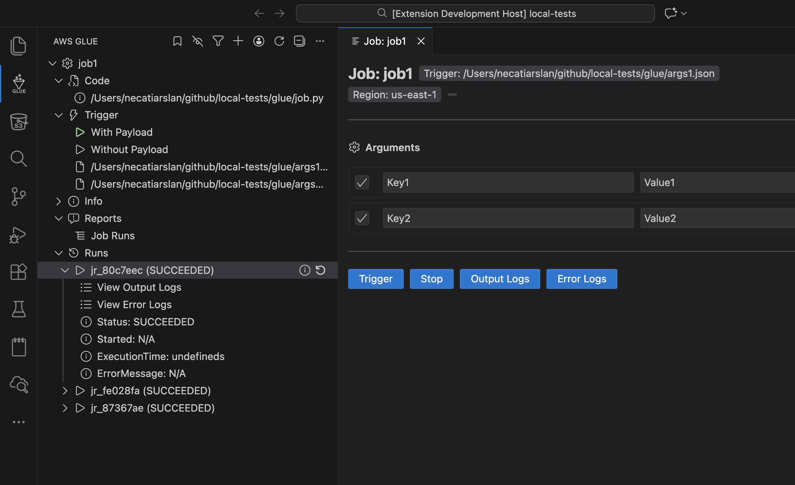

# Aws Glue Extension for VSCode

🚀 **AWS Glue Extension for VSCode** allows you to interact with your AWS Glue Jobs directly within VSCode. This extension streamlines the development, testing, and monitoring of Glue Jobs, providing an intuitive interface for triggering jobs, viewing logs, and managing your ETL workflows—all within your favorite code editor.  

## ✨ Features  

- **Trigger Glue Jobs**: Run your AWS Glue Jobs with ease.  
- **View CloudWatch Logs**: Instantly access logs related to your Glue Job executions. 
- **Manage Glue Jobs**: Add and monitor your Glue Jobs.
- **Code Management**: 
  - **Set Code**: Link a local job code file to your Glue Job
  - **Download Job Code**: Download job code from S3 location
  - **Upload Job Code**: Upload local code changes to the S3 location
  - **Open Job Code**: Open the linked local code file in the editor
  - **Diff Job Code**: Compare local code with S3 version using VS Code's diff viewer
- **AWS Profile Support**: Work with multiple AWS profiles seamlessly.  
- **Endpoint Customization**: Support for LocalStack and custom AWS endpoints.

## Sponsor Me
If you find this extension useful, you can [sponsor me on GitHub](https://github.com/sponsors/necatiarslan).

## Survey
Please take this survey to help me make the extension better.\
TODO: Add Link

## Endpoint Url
You can change your aws endpoint url here. To connect your localstack use the following url: http://localhost:4566

## Aws Credentials Setup
To Access Aws, you need to configure aws credentials. 

For more detail on aws credentials \
https://docs.aws.amazon.com/cli/latest/userguide/cli-configure-files.html \
https://www.youtube.com/watch?v=SON8sY1iOBU

## Bug Report
To report your bugs or request new features, use link below\
https://github.com/necatiarslan/aws-glue-vscode-extension/issues/new

## Todo  
-

## Nice To Have
- 

Follow me on linkedin to get latest news \
https://www.linkedin.com/in/necati-arslan/

Thanks, \
Necati ARSLAN \
necatia@gmail.com
